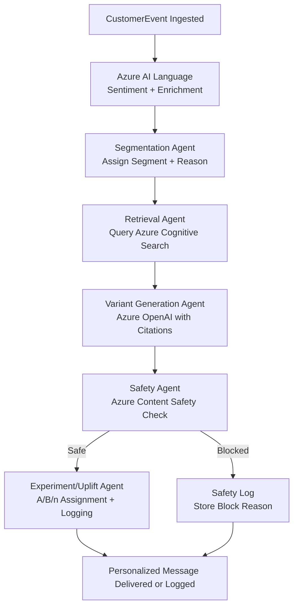
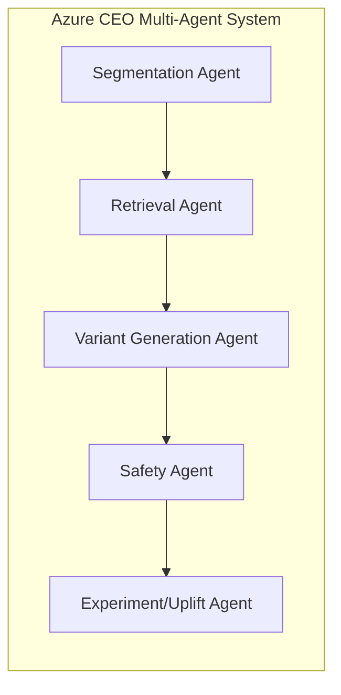

<<<<<<< HEAD
# azure-ceo
=======
# Azure CEO (Customer Event Orchestrator)

Azure CEO is an Azure-native, multi-agent personalization engine transforming raw customer interactions into safe, on-brand personalized messages through Semantic Kernel orchestration and Azure AI services.

## Architecture Overview



## Agents Architecture



## Repo Structure

```plaintext
agents/
  segmentation_agent/
  retrieval_agent/
  variant_agent/
  safety_agent/
  uplift_agent/
orchestration/
connectors/
schemas/
api/
docs/
```

## License
Proprietary. See LICENSE.
>>>>>>> master
